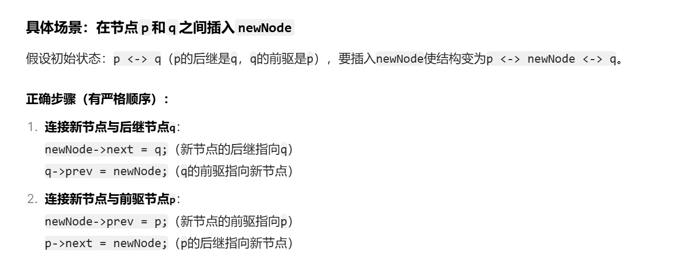
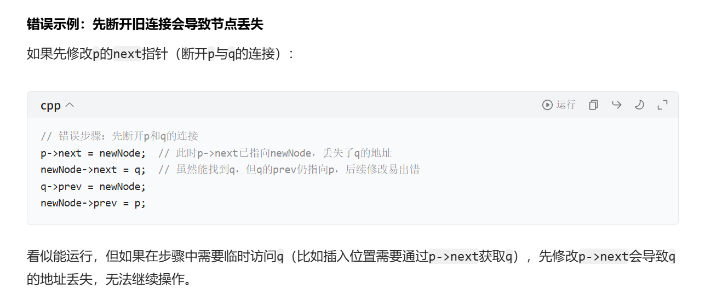
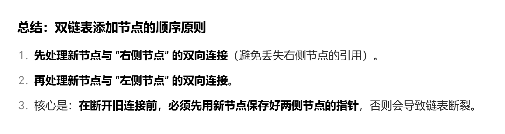
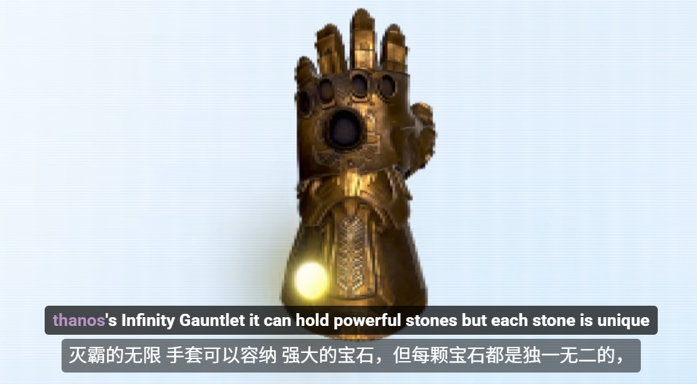
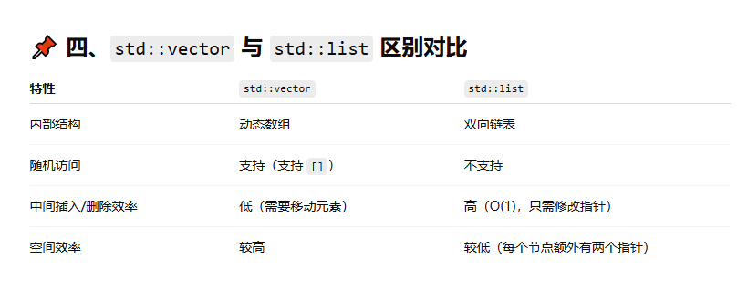

以我的经验，如果是传递基本类型，比如 int、bool 等，用传值比较多，因为这类数据一般不需要在函数内部修改，而且复制的开销很小。

如果是传递容器数据结构，比如 vector、unordered_map 等，用传引用比较多，因为可以避免复制数据副本的开销，而且容器一般需要在函数内部修改。

特别注意一个可能出现的问题，就是当递归函数的参数中有容器数据结构时，千万别使用传值的方式，否则每次递归都会创建一个数据副本，消耗大量的内存和时间，非常容易导致超时或者超内存的错误。

一般来说，当我们想在头部增删元素时会使用**双链表**，因为它在头部增删元素的效率比 vector 高

---

**array**    按照索引因为遍历所以O(n)
**linked list**  插入删除是O(1)  search O(n)  一列火车   node contains a value and an adress  to the next node     
- https://www.youtube.com/watch?v=N6dOwBde7-M&t=106s         (动画原理)
- https://www.youtube.com/watch?v=HKfj0l7ndbc                             (原理C++)
- https://www.youtube.com/watch?v=RNMIDj62o_o                          (插值)
- https://www.youtube.com/watch?v=-StYr9wILqo                             (Doubly Linked Lists)
doubly lists：无内存，且需要插值删除等操作
在链表操作中，我们通常 用一个临时指针反复操作节点，而不是创建多个指针。
双链表添加新节点  
array vs Linked list
array have fixed size but Linked list don't  Linked list have dynamic size
选择 ：想要更快访问元素还是想要更容易增删元素（emmm,我都想要 :O）
**栈(stack)** 是一种后进先出（LIFO  Last-in First-Out）的数据结构，栈适用于只允许在一端（栈顶）添加或移除元素的场景。  薯片
**queue** 是 C++ 标准库中的队列容器，基于先进先出（FIFO,First-in first out超市排队）的原则。just like stack can't access element by index ,so have to go through the whole queue . O(n) .search and access(除了第一个元素)
队列适用于只允许从一端（队尾）添加元素、从另一端（队头）移除元素的场景。   插入删除O(1)
**Heap(Priority queue)** 
- min heap: every parent is smaller than his children,and the top element is the smallest
- max heap:every parent is larger than his children,and the top element is the largest
- root:O(1),arbitrary element :O(n) ,insertion and deletion element:O(logn)
**Binary Search Tree**   O(logn)  order:left smaller  and right greater than parent  ; if tree is unbalanced,like a link list O(n)
**unordered_map** 是 C++ 标准库中的一种哈希表实现，它提供了基于键值对（key-value）的存储，提供了常数时间复杂度的查找、插入和删除键值对的操作。
**set** 每种宝石只放一颗，且无序  use hash

 &#x26a0;&#xfe0f; 特别注意：访问不存在的键会自动插入键值对
在 C++ 的哈希表中，如果你访问一个不存在的键，它会自动创建这个键，对应的值是默认构造的值。
这一点和其他语言不同，需要格外注意。记住访问值之前要先判断键是否存在，否则可能会意外地创建新键，导致算法出错。

**unordered_set** 是 C++ 标准库中的一种哈希集合实现，用于存储不重复的元素，常见使用场景是对元素进行去重。
**std::vector vs std::list**
  

---
**如何判断一个字符是数字还是字母**
- <cctype> (在C语言中是 <ctype.h>)，它包含了一系列用于字符分类的函数。这是最标准、最清晰、最可移植的方法。
>isdigit(char c): 判断字符 c 是否为数字（'0' 到 '9'）。
>isalpha(char c): 判断字符 c 是否为字母（'a' 到 'z' 或 'A' 到 'Z'）。
- 利用 ASCII 码范围手动判断
```
#include <iostream>

void checkCharManual(char c) {
    if (c >= '0' && c <= '9') {
        std::cout << "'" << c << "' 是一个数字。" << std::endl;
    } else if ((c >= 'a' && c <= 'z') || (c >= 'A' && c <= 'Z')) {
        std::cout << "'" << c << "' 是一个字母。" << std::endl;
    } else {
        // ...
    }
}
```

**string转int**
- 并且，字符和其对应的整数值之间的转换有一个小技巧：'字符' - '0'。例如，'5' - '0' 的结果就是整数 5
```
#include <string>
std::string num_str = "300";
int number = std::stoi(num_str);
```

- 手动遍历计算 (最适用于“字符串解码”算法)
> 并且，字符和其对应的整数值之间的转换有一个小技巧：'字符' - '0'。例如，'5' - '0' 的结果就是整数 5