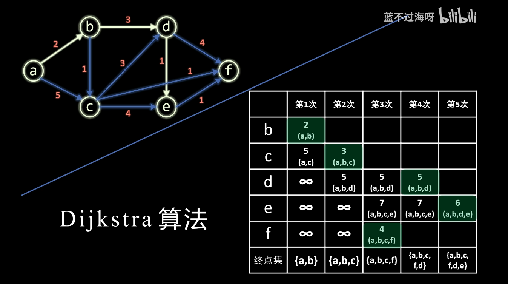
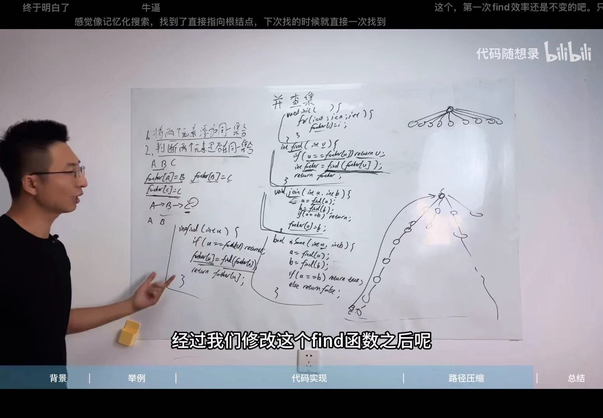

**邻接矩阵 (Adjacency Matrix)**
优点：查询两个顶点间是否有边非常快，时间复杂度 O(1)。
缺点：当图是稀疏图（顶点多，边少）时，非常浪费空间。空间复杂度 O(V²)。
结构类似为：
adj_matrix = [
    [0, 1, 1],  # A 连接着 B 和 C
    [1, 0, 0],  # B 连接着 A
    [1, 0, 0]   # C 连接着 A
]
**邻接表 (Adjacency List)**
优点：节省空间，空间复杂度为 O(V+E)，其中 V 是顶点数，E
是边数。获取一个顶点的所有邻居非常方便。 缺点：查询两个顶点 u, v
之间是否有边，需要遍历 u 的邻接表，时间复杂度为 O(degree(u))，最坏为 O(V)。
结构类似为：
adj_list = {
    '0': ['1', '2', '3'],  # 0 连接着 1, 2, 3
    '1': ['0', '4'],       # 1 连接着 0, 4
    '2': ['0','3']        # 2 连接着 0, 3
    '3': ['0']        # 3 连接着 0
    '4': ['1']        # 4 连接着 1
}

eg:对于像微信这样拥有数十亿用户（顶点 $V$），但人均好友只有几百个（边 $E$）的系统，邻接表（Adjacency List）确实是唯一的工程选择。如果用邻接矩阵，空间复杂度是 $O(V^2)$。假设有 $10^9$ 用户，矩阵就需要 $10^{18}$ 个存储单元，这在目前的硬件水平下是不可能实现的。而邻接表只需要 $O(V + E)$ 的空间，只记录真实存在的友谊。

BFS: 广度优先搜索
将没见过的顶点加入队列，遍历队列。
定义一个队列，存储待访问的顶点
从邻接表的根顶点开始，将根顶点（0）加入队列，标记为已访问。标记完之后pop.
1. 判断队列是否为空
2. 若队列不为空：取出队列的front,访问它的所有邻居，将未访问过的邻居加入队列(1,2,3)，标记为已访问。
q:[0]-->[1,2,3]-->[2,3,4]-->[3,4]-->[4]
标记vector：[0,1,2,3,4]
[false,false,false,false,false] -->[true,false,false,false,false]-->[true,true,false,false,false]-->[true,true,true,false,false]-->[true,true,true,true,false]-->[true,true,true,true,true]
若队列为空，代表所有顶点都被访问过了。退出搜索

DFS: 深度优先搜索
也遇到一个数，就深挖下去，直到不满足条件，再返回。
遍历顶点0的邻居(顺便*标0*为true)：['1','2','3'],*先1*，标true，进入for,递归  
    看1的邻居，有['0','4']，进入for,0已经被标记为true，不递归；
    然后是4，*标4*，看4的邻居，有['1']，进入for,1已经被标记为true，不递归。返回。
然后看2，*标2*，看2的邻居，有['0','3']，进入for,0已经被标记为true，不递归；
    然后是3，*标3*，看3的邻居，有['0']，进入for,0已经被标记为true，不递归。返回。

```C++
priority_queue<PII, vector<PII>, greater<PII>> pq;
```
PII: pair<int, int>
greater<PII>:从小到大排序。
greater = 从小到大排序
less = 从大到小排序（默认）

你可以前往力扣尝试这几道经典的 Dijkstra 题目：

743. 网络延迟时间 (Network Delay Time) —— 最基础的 Dijkstra 模板题。

1631. 最小体力消耗路径 (Path With Minimum Effort) —— 在网格图上应用 Dijkstra。

787. K 站中转内最便宜的航班 (Cheapest Flights Within K Stops) —— 带有约束的最短路（Dijkstra 的进阶变体）。


dijkstra算法：从起点到所有顶点的最小距离。实质上是更新某顶点到起点的距离。初始设为无穷，如果算出来的距离比记录的距离小，则保留。有一个优先队列pq（按照距离的大小由小到大）存储数组信息。计算距离时，拿出这个队列pq中距离最小的顶点，加上各自（距离最小的顶点连接着的顶点）的距离。
以第二次为例：优先队列pq里面最小距离为3，对应的定点为c,c连接着d,f,e;对应的边权分别是3，1，4，3分别加上3，1，4得6，4，7。6比第二次得到的d的距离大，不更新；4比第二次得到的∞的距离小，更新为4；7和第二次得到的7相同，不更新。这样，就更新了a点到d,e,f,距离的最小值。将跟新了的<距离，点数>添加至优先队列pq。
最小生成树：
prim:适合稠密图。先点亮一个点，然后从这个点开始，找到所有未点亮的点中，距离已点亮的所有点中最近的点，点亮它。
kruskal:加边，适用于稀疏图。从最小边权开始加边，不能构成连通图（环），直到所有顶点都被访问过。除此之外，并查集是关键。主要是实现：1.将两个元素添加到同一个集合。2.判断两个元素是否在同一个集合。实现find,join,issame函数。

floyd算法: