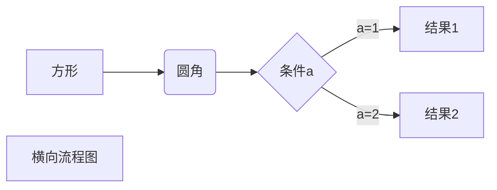
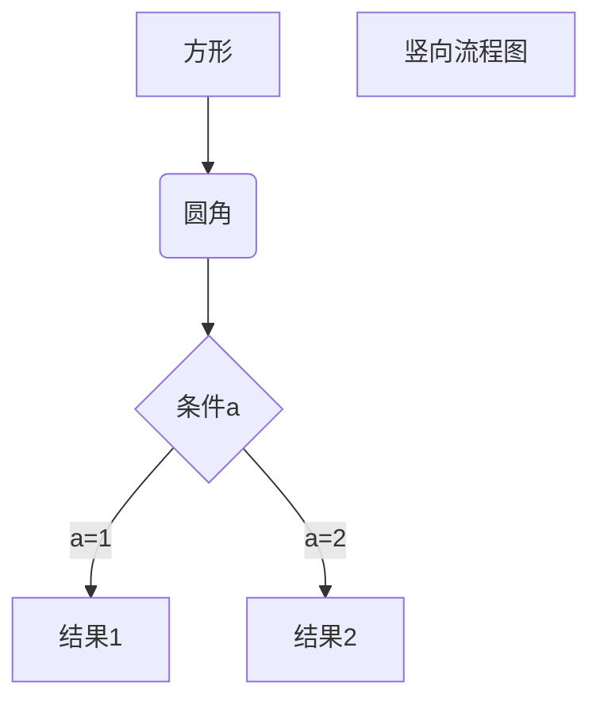

| 状态 | 图标 | 说明 |
|:----:|:----:|------|
| 完成 | &#x2705; | 任务已完成 |
| 进行中 | &#x1f504; | 正在处理 |
| 待处理 | &#x23f3; | 等待开始 |
| 错误 | &#x274c; | 出现问题 |
| 警告 | &#x26a0;&#xfe0f; | 需要注意 |

- [ ] 未完成的任务
- [x] 已完成的任务
- [ ] 另一个未完成的任务


| 特性 | React | Vue.js | Angular | 评分 |
|------|:-----:|:------:|:-------:|:----:|
| 学习曲线 | 中等 | 简单 | 复杂 | Vue &#x2b50;&#x2b50;&#x2b50; |
| 性能表现 | 优秀 | 优秀 | 良好 | 平分 &#x2b50;&#x2b50;&#x2b50; |
| 生态系统 | 丰富 | 成长中 | 完整 | React &#x2b50;&#x2b50;&#x2b50; |
| 企业支持 | Facebook | 社区 | Google | Angular &#x2b50;&#x2b50;&#x2b50; |


使用 <kbd>Ctrl</kbd>+<kbd>Alt</kbd>+<kbd>Del</kbd> 重启电脑







```flow
st=>start: 开始框
op=>operation: 处理框
cond=>condition: 判断框(是或否?)
sub1=>subroutine: 子流程
io=>inputoutput: 输入输出框
e=>end: 结束框
st(right)->op(right)->cond
cond(yes)->io(bottom)->e
cond(no)->sub1(right)->op
```

---


文本中的变量 $x = 5$ 和函数 $f(x) = x^2 + 2x + 1$。

$$
    \begin{align}
    f(x) &= ax^2 + bx + c \\
    f'(x)  &= 2ax + b \\
    f''(x)  &= 2a
    \end{align}
    $$


$$E = mc^2$$

$$\int_{-\infty}^{\infty} e^{-x^2} dx = \sqrt{\pi}$$

---
# 张三 | 前端开发工程师

## &#x1f4de; 联系方式
- **邮箱**: zhangsan@email.com
- **电话**: 138-0000-0000
- **GitHub**: [github.com/zhangsan](https://github.com/zhangsan)
- **LinkedIn**: [linkedin.com/in/zhangsan](https://linkedin.com/in/zhangsan)
- **地址**: 上海市浦东新区

## &#x1f3af; 职业目标
具有3年前端开发经验的工程师，专注于React生态系统和现代化Web应用开发。寻求在创新型公司中担任高级前端开发职位，希望参与大型项目的架构设计和团队协作。

## &#x1f4bc; 工作经验

### 高级前端开发工程师 | ABC科技有限公司
**2022.03 - 至今**

- 负责公司核心产品的前端开发，用户量达100万+
- 使用React、TypeScript构建可维护的大型单页应用
- 与产品和设计团队协作，将设计稿转化为高质量的用户界面
- 建立前端组件库，提升团队开发效率30%
- **技术栈**: React, TypeScript, Redux, Webpack, Jest

### 前端开发工程师 | XYZ互联网公司
**2021.06 - 2022.02**

- 参与电商平台的前端开发和维护工作
- 优化页面性能，首屏加载时间减少40%
- 负责移动端H5页面开发，适配多种设备
- **技术栈**: Vue.js, JavaScript, SCSS, Element UI
---
## &#x1f6e0;&#xfe0f; 技能清单

### 编程语言
- **熟练**: JavaScript, TypeScript, HTML5, CSS3
- **了解**: Python, Java, Go

### 前端框架
- **React生态**: React, Redux, React Router, Next.js
- **Vue生态**: Vue.js, Vuex, Vue Router, Nuxt.js
- **其他**: Angular基础

### 开发工具
#### 版本控制
- Git, GitHub, GitLab

#### 构建工具
- Webpack, Vite, Rollup
- Babel, PostCSS

#### 测试工具
- Jest, Cypress, Testing Library
---
## &#x1f4f1; 联系方式
## &#x1f4bc; 工作经验  
## &#x1f393; 教育背景
## &#x1f6e0;&#xfe0f; 技能清单
## &#x1f680; 项目经历
## &#x1f3c6; 获奖经历

---
## &#x1f4ca; 技能评估

| 技能类别 | 具体技能 | 熟练程度 |
|---------|---------|---------|
| 前端框架 | React | &#x2b50;&#x2b50;&#x2b50;&#x2b50;&#x2b50; |
| 前端框架 | Vue.js | &#x2b50;&#x2b50;&#x2b50;&#x2b50; |
| 编程语言 | TypeScript | &#x2b50;&#x2b50;&#x2b50;&#x2b50; |
| 编程语言 | JavaScript | &#x2b50;&#x2b50;&#x2b50;&#x2b50;&#x2b50; |

---
## &#x1f517; 在线作品

[](https://zhangsan.dev)
[](https://github.com/zhangsan)
[](https://juejin.cn/user/zhangsan)

---
